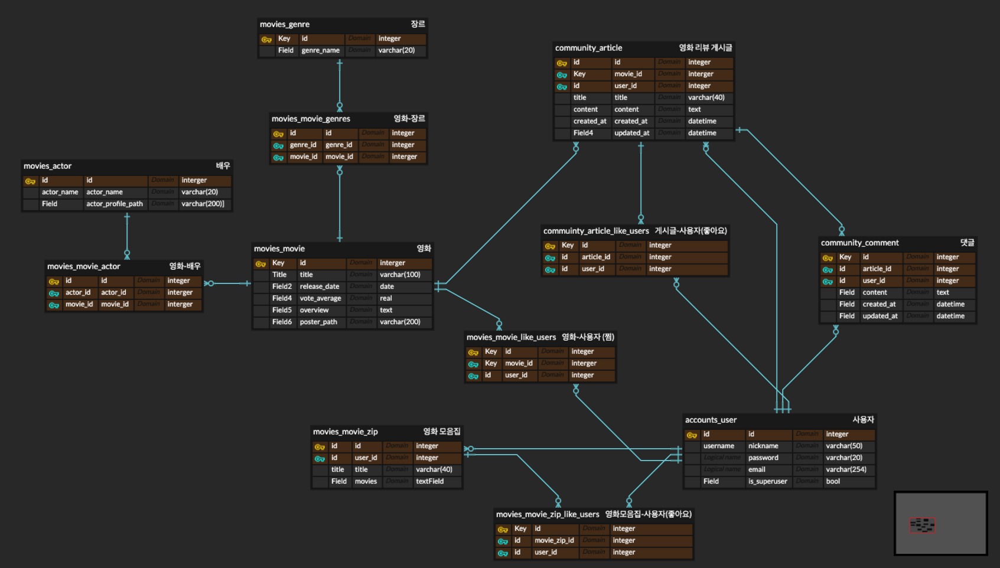
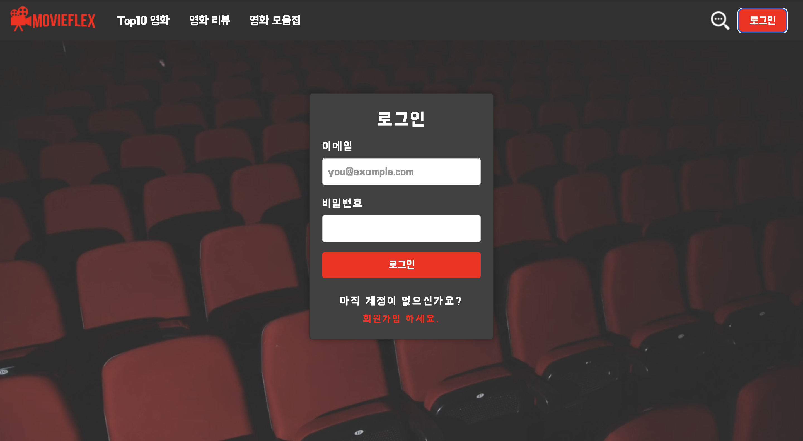
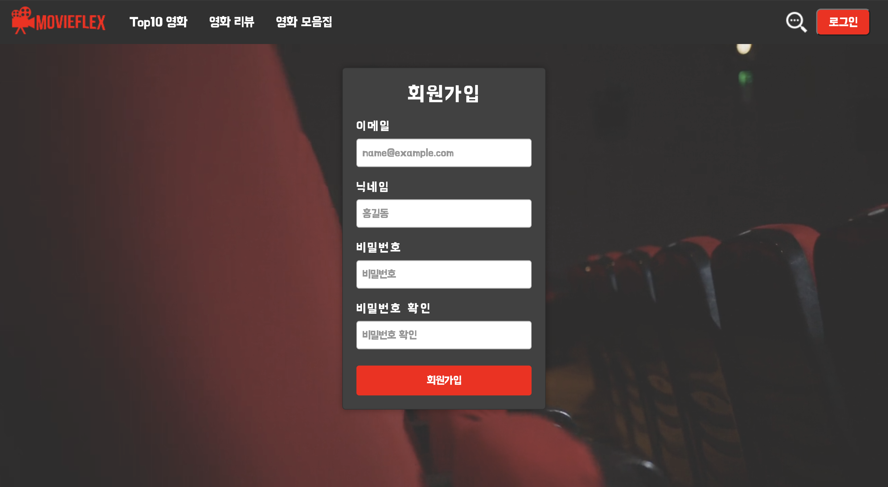

# MOVIEFLEX

## 📝 기능 설명
자신이 추천하고 싶은 영화들을 묶어 영화 모음집을 생성해 공유할 수 있는 사이트 입니다.
 + 부가기능
- TOP 10 영화를 tmdb api를 통해 받아와 보여줍니다.
- 영화에 대한 리뷰를 남길 수 있고, 댓글을 남길 수 있습니다.

## 🗓️개발기간
2023.11.20 - 2023.11.24

## 🛠️기술 스택
**FrontEnd** : `Vue.js`, JavaScript, CSS, Bootstrap5

**BackEnd** : `Django`, python, SQLite

## 📊 ERD

## 화면 구성

1. 로딩화면 애니메이션

https://github.com/KINHYEONJI/MovieFlex/assets/88700047/6877c04f-5acc-4a31-a3fe-8a490beaf1aa

2. TOP10

https://github.com/KINHYEONJI/MovieFlex/assets/88700047/cb544f9e-44e7-4b48-b24d-3c4ce98de520

3. 리뷰 생성

https://github.com/KINHYEONJI/MovieFlex/assets/88700047/e09a659e-ff54-4c18-9a3c-3c7a97b9dc79

4. 리뷰 상세 조회

https://github.com/KINHYEONJI/MovieFlex/assets/88700047/0a62962b-1b1f-4375-9085-734ed11f94f8

5. 영화 모음집 생성

https://github.com/KINHYEONJI/MovieFlex/assets/88700047/bcd0f869-877e-4609-abd4-a1d0c16345f3

6. 영화 모음집 상세 조회

https://github.com/KINHYEONJI/MovieFlex/assets/88700047/c7800db6-e8da-4cfc-bec7-f235beef6c8d

7. 로그인 / 회원가입
  
  
